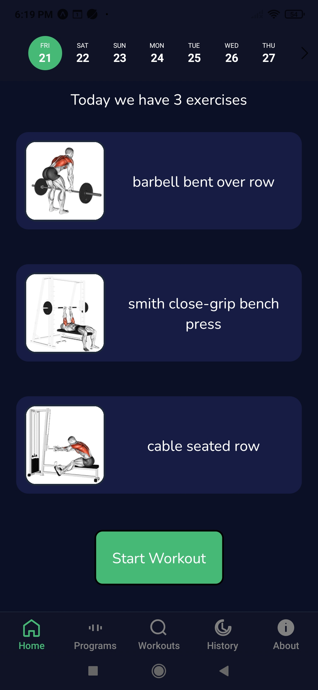
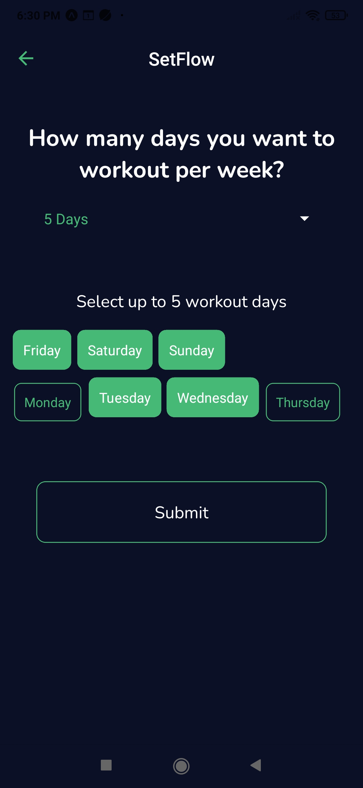
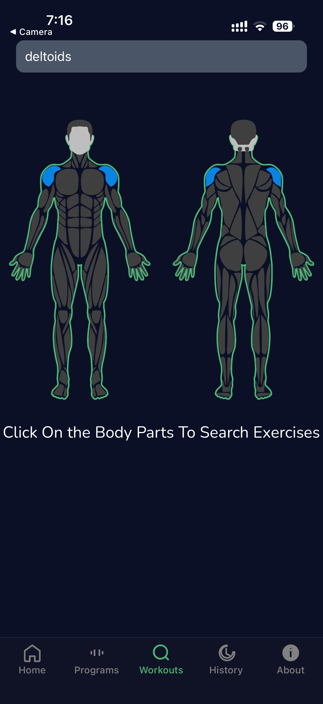
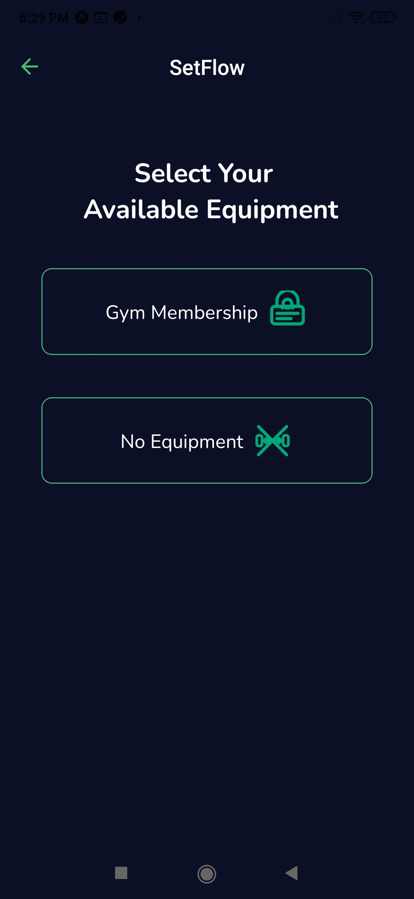
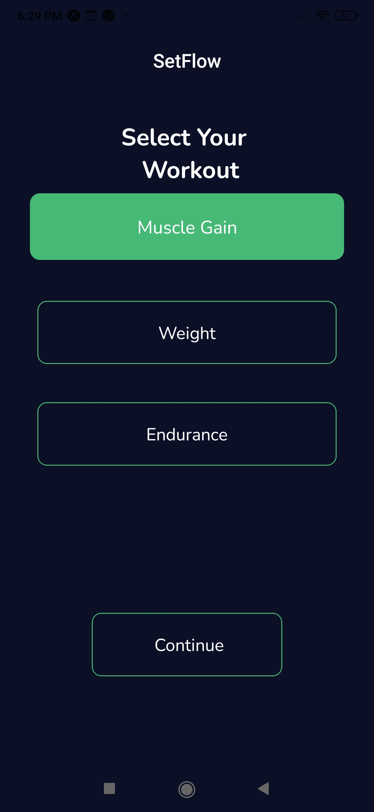
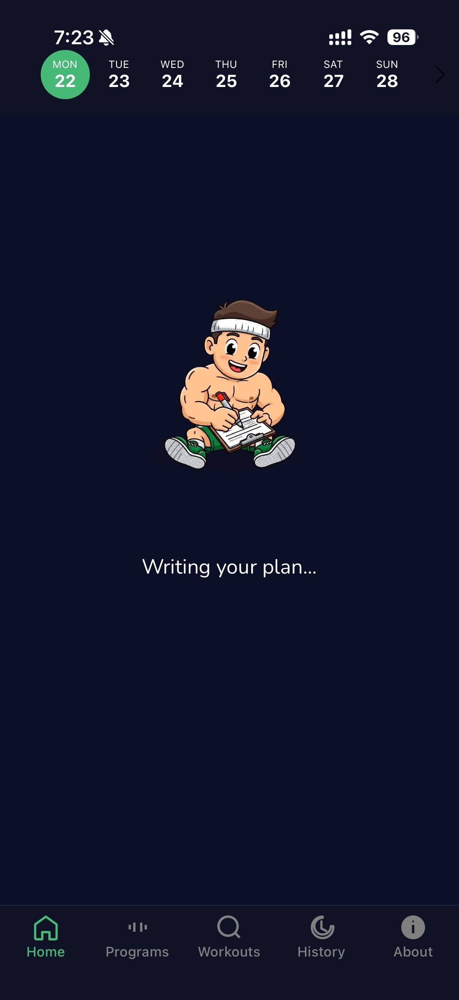

# 🏋️ Setflow

Setflow is a mobile fitness workflow application that helps users build
personalized workout plans through a guided, step-by-step flow.
The app focuses on smooth UX, clear structure, and interactive animations.

---

## ✨ Features
- Step-by-step workout plan builder
- Workout data fetched from an external REST API
- Search workouts by muscle group and body figure
- Equipment-based workout selection
- Smooth Lottie animations for loading and transitions
- Clean mobile-first UI built with React Native & Expo

---

## 🖼 App Screens

### Home

### Plan Duration

### Programs

### Search Workout

### Search by Body Figure

### Select Equipment

### Select Workout

### Workout Flow

### Writing Plan (Lottie Animation)

---

## 🛠 Tech Stack
- React Native
- Expo
- JavaScript
- Lottie Animations
- REST API (Workout data fetching)

---

## 🚀 Project Status
Actively developing

---

## 👤 Author
**Dato Sebiskveradze**  
Frontend Developer — Tbilisi, Georgia

